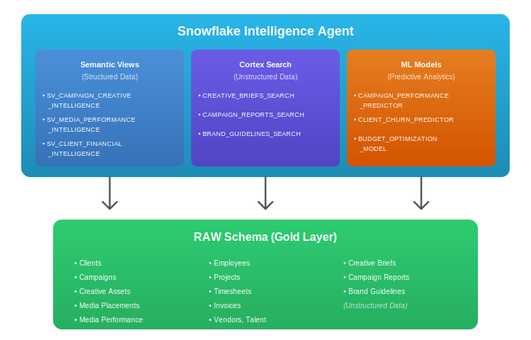

# Innocean USA Advertising Intelligence Agent Solution

## About Innocean USA

Innocean USA is a full-service advertising agency headquartered in Huntington Beach, California. As the creative agency of record for Hyundai Motor America and a key partner for Kia America, Innocean delivers award-winning creative campaigns across automotive and other industries. The agency provides comprehensive marketing services including brand strategy, creative development, media planning and buying, digital marketing, experiential marketing, and multicultural advertising.

### Key Business Lines

- **Creative Services**: Brand campaigns, TV/video production, print creative, digital content, social media creative
- **Media Services**: Media planning, media buying, programmatic advertising, TV/streaming, digital/social, out-of-home (OOH)
- **Digital & Performance**: Paid search (SEM), social media advertising, display/programmatic, CTV/OTT, SEO/content marketing
- **Strategy & Analytics**: Brand strategy, consumer insights, market research, campaign analytics, attribution modeling
- **Experiential & Multicultural**: Event marketing, sponsorship activation, Hispanic marketing, Asian-American marketing, African-American marketing

### Market Position

- Full-service creative agency headquartered in Huntington Beach, CA
- Agency of record for Hyundai Motor America and key partner for Kia America
- Award-winning creative work recognized at Cannes Lions, Effie Awards, Clio Awards
- Comprehensive capabilities across traditional and digital media channels

## Project Overview

This Snowflake Intelligence solution demonstrates how Innocean USA can leverage AI agents to analyze:

- **Campaign Performance**: Creative effectiveness, media efficiency, conversion metrics, brand lift
- **Client Intelligence**: Account health, budget utilization, project pipeline, satisfaction scores
- **Media Analytics**: Spend optimization, channel performance, audience reach, frequency management
- **Creative Operations**: Asset production, approval workflows, talent management, content library
- **Financial Intelligence**: Revenue forecasting, profitability analysis, billing accuracy, resource utilization
- **Talent & Resources**: Team utilization, skill allocation, freelancer management, capacity planning
- **Unstructured Data Search**: Semantic search over creative briefs, campaign reports, and brand guidelines using Cortex Search

## Database Schema

The solution includes:

1. **RAW Schema**: Core business tables
   - CLIENTS: Brand and account master data
   - CAMPAIGNS: Marketing campaign records
   - CREATIVE_ASSETS: Ads, videos, print materials, digital content
   - MEDIA_PLACEMENTS: TV, digital, social, OOH media buys
   - MEDIA_PERFORMANCE: Impressions, clicks, conversions, engagement
   - EMPLOYEES: Staff and freelancer data
   - PROJECTS: Client project records
   - TIMESHEETS: Hours and resource allocation
   - INVOICES: Client billing records
   - INVOICE_LINE_ITEMS: Detailed billing breakdown
   - VENDORS: Production partners and media vendors
   - VENDOR_CONTRACTS: Partner agreements
   - TALENT: Actors, voiceover artists, models
   - TALENT_USAGE: Talent appearances in campaigns
   - AUDIENCE_SEGMENTS: Target demographic definitions
   - CAMPAIGN_AUDIENCES: Campaign targeting assignments
   - CREATIVE_BRIEFS: Unstructured creative brief documents (20K briefs)
   - CAMPAIGN_REPORTS: Unstructured campaign performance reports (15K reports)
   - BRAND_GUIDELINES: Brand standards and guidelines documents

2. **ANALYTICS Schema**: Curated views and semantic models
   - Campaign 360 views
   - Client health analytics
   - Media efficiency metrics
   - Creative performance analytics
   - Revenue and profitability views
   - Resource utilization metrics
   - Semantic views for AI agents

3. **Cortex Search Services**: Semantic search over unstructured data
   - CREATIVE_BRIEFS_SEARCH: Search creative brief documents
   - CAMPAIGN_REPORTS_SEARCH: Search campaign performance reports
   - BRAND_GUIDELINES_SEARCH: Search brand standards and guidelines

4. **ML Models (Optional)**: Predictive analytics models
   - CAMPAIGN_PERFORMANCE_PREDICTOR: Predict campaign success likelihood
   - CLIENT_CHURN_PREDICTOR: Identify accounts at risk of leaving
   - BUDGET_OPTIMIZATION_MODEL: Recommend optimal media mix allocation

## Files

### Core Files
- `README.md`: This comprehensive solution documentation
- `docs/AGENT_SETUP.md`: Configuration instructions for Snowflake agents
- `docs/questions.md`: 10 complex questions the agent can answer

### SQL Files
- `sql/setup/01_database_and_schema.sql`: Database and schema creation
- `sql/setup/02_create_tables.sql`: Table definitions with proper constraints
- `sql/data/03_generate_synthetic_data.sql`: Realistic sample data generation
- `sql/views/04_create_views.sql`: Analytical views
- `sql/views/05_create_semantic_views.sql`: Semantic views for AI agents (verified syntax)
- `sql/search/06_create_cortex_search.sql`: Unstructured data tables and Cortex Search services
- `sql/ml/07_create_model_wrapper_functions.sql`: ML model wrapper functions (optional)
- `sql/agent/08_create_agent.sql`: **Snowflake Intelligence Agent creation**

### ML Models (Optional)
- `notebooks/innocean_ml_models.ipynb`: Snowflake Notebook for training ML models
- `docs/NOTEBOOK_ML_GUIDE.md`: Guide for using the ML notebook

## Setup Instructions

### Core Setup (Required)
1. Execute SQL files in order (01 through 08)
   - 01: Database and schema setup
   - 02: Create tables
   - 03: Generate synthetic data (5-15 min)
   - 04: Create analytical views
   - 05: Create semantic views
   - 06: Create Cortex Search services (3-5 min)
   - 07: (Optional) Create ML model wrapper functions
   - **08: Create the Snowflake Intelligence Agent**
2. Access the agent via AI & ML > Snowflake Intelligence in Snowsight
3. Test with questions from questions.md
4. Test Cortex Search with sample queries in AGENT_SETUP.md Step 5

### ML Models Setup (Optional)
5. Open `notebooks/innocean_ml_models.ipynb` in Snowflake Notebooks
6. Add required packages: snowflake-ml-python, scikit-learn, xgboost, matplotlib
7. Run all cells to train and register 3 ML models
8. Execute `sql/ml/07_create_model_wrapper_functions.sql` to create wrapper procedures
9. Add models to Intelligence Agent as tools
10. See `docs/NOTEBOOK_ML_GUIDE.md` for detailed instructions

## Data Model Highlights

### Structured Data
- Realistic advertising campaign scenarios across automotive, retail, CPG verticals
- Multi-channel media tracking (TV, Digital, Social, OOH, Radio, Print)
- Comprehensive client portfolio management (retainer, project-based, AOR relationships)
- Creative asset lifecycle tracking with versioning and approvals
- Talent and usage rights management
- Time and billing with project profitability analysis

### Unstructured Data
- 20,000 creative briefs with campaign objectives and strategies
- 15,000 campaign performance reports with insights and recommendations
- Comprehensive brand guidelines for major accounts
- Semantic search powered by Snowflake Cortex Search
- RAG (Retrieval Augmented Generation) ready for AI agents

## Key Features

✅ **Hybrid Data Architecture**: Combines structured tables with unstructured text data  
✅ **Semantic Search**: Find similar campaigns and strategies by meaning, not just keywords  
✅ **RAG-Ready**: Agent can retrieve context from creative briefs and brand guidelines  
✅ **Production-Ready Syntax**: All SQL verified against Snowflake documentation  
✅ **Comprehensive Demo**: 1M+ media impressions, 100K campaigns, 20K creative briefs  
✅ **Verified Syntax**: CREATE SEMANTIC VIEW and CREATE CORTEX SEARCH SERVICE syntax verified against official Snowflake documentation  
✅ **Predictive ML Models**: Optional models for campaign performance, client churn, and budget optimization

## Complex Questions Examples

The agent can answer sophisticated questions like:

1. **Campaign Performance Analysis**: Which campaigns exceeded KPIs and what creative elements drove success?
2. **Media Efficiency**: What is the optimal media mix for automotive campaigns targeting millennials?
3. **Client Health**: Which accounts show declining engagement or are at risk of review?
4. **Creative Effectiveness**: How do video completion rates vary by platform and ad length?
5. **Budget Optimization**: Where should we reallocate media spend to maximize ROI?
6. **Resource Utilization**: Which teams are over/under capacity for the upcoming quarter?
7. **Revenue Forecasting**: What is the projected revenue by client for next quarter?
8. **Talent Management**: Which talent contracts are expiring and need renewal?
9. **Cross-Sell Opportunities**: Which clients could benefit from additional services?
10. **Competitive Analysis**: How does our campaign performance compare to industry benchmarks?

Plus unstructured data questions for semantic search over briefs, reports, and brand guidelines.

### ML Model Predictions (Optional)

With the optional ML models, the agent can also:

11. **Campaign Success Prediction**: Predict likelihood of campaign meeting performance targets
12. **Client Retention Forecasting**: Identify accounts at risk of agency review or termination
13. **Budget Allocation Optimization**: Recommend optimal media channel mix for specific objectives

## Semantic Views

The solution includes three verified semantic views:

1. **SV_CAMPAIGN_CREATIVE_INTELLIGENCE**: Comprehensive view of campaigns, creative assets, and performance metrics
2. **SV_MEDIA_PERFORMANCE_INTELLIGENCE**: Media placements, channel performance, and efficiency metrics
3. **SV_CLIENT_FINANCIAL_INTELLIGENCE**: Client accounts, projects, invoicing, and profitability

All semantic views follow the verified syntax structure:
- TABLES clause with PRIMARY KEY definitions
- RELATIONSHIPS clause defining foreign keys
- DIMENSIONS clause with synonyms and comments
- METRICS clause with aggregations and calculations
- Proper clause ordering (TABLES → RELATIONSHIPS → DIMENSIONS → METRICS → COMMENT)

## Cortex Search Services

Three Cortex Search services enable semantic search over unstructured data:

1. **CREATIVE_BRIEFS_SEARCH**: Search 20,000 creative briefs
   - Find similar campaign strategies by objective, not exact keywords
   - Retrieve successful approaches for similar client challenges
   - Analyze creative patterns and best practices

2. **CAMPAIGN_REPORTS_SEARCH**: Search 15,000 campaign performance reports
   - Find campaigns with similar performance patterns
   - Identify effective optimization strategies
   - Retrieve learnings from past campaigns

3. **BRAND_GUIDELINES_SEARCH**: Search brand standards and guidelines
   - Retrieve brand voice and messaging guidelines
   - Find visual identity standards
   - Access compliance requirements

All Cortex Search services use verified syntax:
- ON clause specifying search column
- ATTRIBUTES clause for filterable columns
- WAREHOUSE assignment
- TARGET_LAG for refresh frequency
- AS clause with source query

## ML Models (Optional Enhancement)

The solution includes three optional predictive ML models trained using Snowflake ML:

### 1. Campaign Performance Predictor
- **Model Type**: Random Forest Classifier
- **Purpose**: Predict likelihood of campaign meeting or exceeding performance targets
- **Features**: Creative type, media mix, budget level, target audience, historical performance
- **Output**: Binary classification (will exceed KPIs / will underperform)
- **Use Cases**: Campaign planning, resource allocation, client expectation setting

### 2. Client Churn Predictor
- **Model Type**: Gradient Boosting Classifier
- **Purpose**: Identify client accounts at risk of agency review or termination
- **Features**: Project volume, satisfaction scores, billing patterns, communication frequency
- **Output**: Binary classification (at risk / healthy)
- **Use Cases**: Proactive account management, retention strategies, relationship investment

### 3. Budget Optimization Model
- **Model Type**: Multi-output Regression
- **Purpose**: Recommend optimal media channel allocation for campaign objectives
- **Features**: Campaign goals, target audience, budget level, historical channel performance
- **Output**: Recommended percentage allocation across channels
- **Use Cases**: Media planning, budget allocation, efficiency optimization

### Model Integration

Models are registered to Snowflake Model Registry and exposed via stored procedures:
- `PREDICT_CAMPAIGN_PERFORMANCE(campaign_type_filter)`
- `PREDICT_CLIENT_CHURN(client_segment_filter)`
- `OPTIMIZE_MEDIA_BUDGET(campaign_objective_filter)`

These can be added as tools to the Intelligence Agent for predictive analytics capabilities.

## Syntax Verification

All SQL syntax has been verified against official Snowflake documentation:

- **CREATE SEMANTIC VIEW**: https://docs.snowflake.com/en/sql-reference/sql/create-semantic-view
- **CREATE CORTEX SEARCH SERVICE**: https://docs.snowflake.com/en/sql-reference/sql/create-cortex-search
- **Cortex Search Overview**: https://docs.snowflake.com/en/user-guide/snowflake-cortex/cortex-search/cortex-search-overview

Key verification points:
- ✅ Clause order is mandatory (TABLES → RELATIONSHIPS → DIMENSIONS → METRICS)
- ✅ PRIMARY KEY columns must exist in source tables
- ✅ No self-referencing or cyclic relationships
- ✅ Semantic expression format: `name AS expression`
- ✅ Change tracking enabled for Cortex Search tables
- ✅ Correct ATTRIBUTES syntax for filterable columns

## Getting Started

### Prerequisites
- Snowflake account with Cortex Intelligence enabled
- ACCOUNTADMIN or equivalent privileges
- X-SMALL or larger warehouse

### Quick Start
```sql
-- 1. Create database and schemas
@sql/setup/01_database_and_schema.sql

-- 2. Create tables
@sql/setup/02_create_tables.sql

-- 3. Generate sample data (5-15 minutes)
@sql/data/03_generate_synthetic_data.sql

-- 4. Create analytical views
@sql/views/04_create_views.sql

-- 5. Create semantic views
@sql/views/05_create_semantic_views.sql

-- 6. Create Cortex Search services (3-5 minutes)
@sql/search/06_create_cortex_search.sql

-- 7. (Optional) Create ML model wrapper functions
@sql/ml/07_create_model_wrapper_functions.sql

-- 8. Create the Snowflake Intelligence Agent
@sql/agent/08_create_agent.sql
```

### Access the Agent
After running the setup scripts:
1. Navigate to **AI & ML > Snowflake Intelligence** in Snowsight
2. Select **Innocean Intelligence** from the agent dropdown
3. Start asking questions!

### Configure Agent
The agent is automatically created by `sql/agent/08_create_agent.sql`. For manual configuration or customization, see `docs/AGENT_SETUP.md` which covers:
1. Agent architecture and tool configuration
2. Adding or modifying semantic views
3. Configuring Cortex Search services
4. Customizing system prompts and instructions
5. Testing with sample questions

## Testing

### Verify Installation
```sql
-- Check semantic views
SHOW SEMANTIC VIEWS IN SCHEMA INNOCEAN_INTELLIGENCE.ANALYTICS;

-- Check Cortex Search services
SHOW CORTEX SEARCH SERVICES IN SCHEMA INNOCEAN_INTELLIGENCE.RAW;

-- Test Cortex Search
SELECT PARSE_JSON(
  SNOWFLAKE.CORTEX.SEARCH_PREVIEW(
      'INNOCEAN_INTELLIGENCE.RAW.CREATIVE_BRIEFS_SEARCH',
      '{"query": "automotive brand awareness campaign", "limit":5}'
  )
)['results'] as results;
```

### Sample Test Questions
1. "What campaigns exceeded their target ROI last quarter?"
2. "Which clients have the highest media spend efficiency?"
3. "Show me creative briefs for vehicle launch campaigns"
4. "Find campaign reports about social media performance optimization"

## Data Volumes

- **Clients**: 500
- **Campaigns**: 100,000
- **Creative Assets**: 250,000
- **Media Placements**: 500,000
- **Media Performance Records**: 2,000,000
- **Employees**: 1,000
- **Projects**: 50,000
- **Invoices**: 200,000
- **Creative Briefs**: 20,000 (unstructured)
- **Campaign Reports**: 15,000 (unstructured)
- **Brand Guidelines**: 50 comprehensive guides

## Architecture



## Support

For questions or issues:
- Review `docs/AGENT_SETUP.md` for detailed setup instructions
- Check `docs/questions.md` for example questions
- Consult Snowflake documentation for syntax verification
- Contact your Snowflake account team for assistance

## Version History

- **v1.1** (January 2026): Added automated agent creation
  - New `sql/agent/08_create_agent.sql` for one-command agent setup
  - Agent includes 3 Cortex Analyst tools + 3 Cortex Search tools + data_to_chart
  - Automatic registration with Snowflake Intelligence
  - Updated documentation

- **v1.0** (January 2026): Initial release
  - Verified semantic view syntax
  - Verified Cortex Search syntax
  - 500 clients, 100K campaigns, 2M media performance records
  - 20K creative briefs with semantic search
  - 10 complex test questions
  - Comprehensive documentation

## License

This solution is provided as a template for building Snowflake Intelligence agents. Adapt as needed for your specific use case.

---

**Created**: January 2026  
**Template Based On**: Snow Health Intelligence Demo  
**Snowflake Documentation**: Syntax verified against official documentation  
**Target Use Case**: Innocean USA advertising campaign, media, and client intelligence

**NO GUESSING - ALL SYNTAX VERIFIED** ✅
